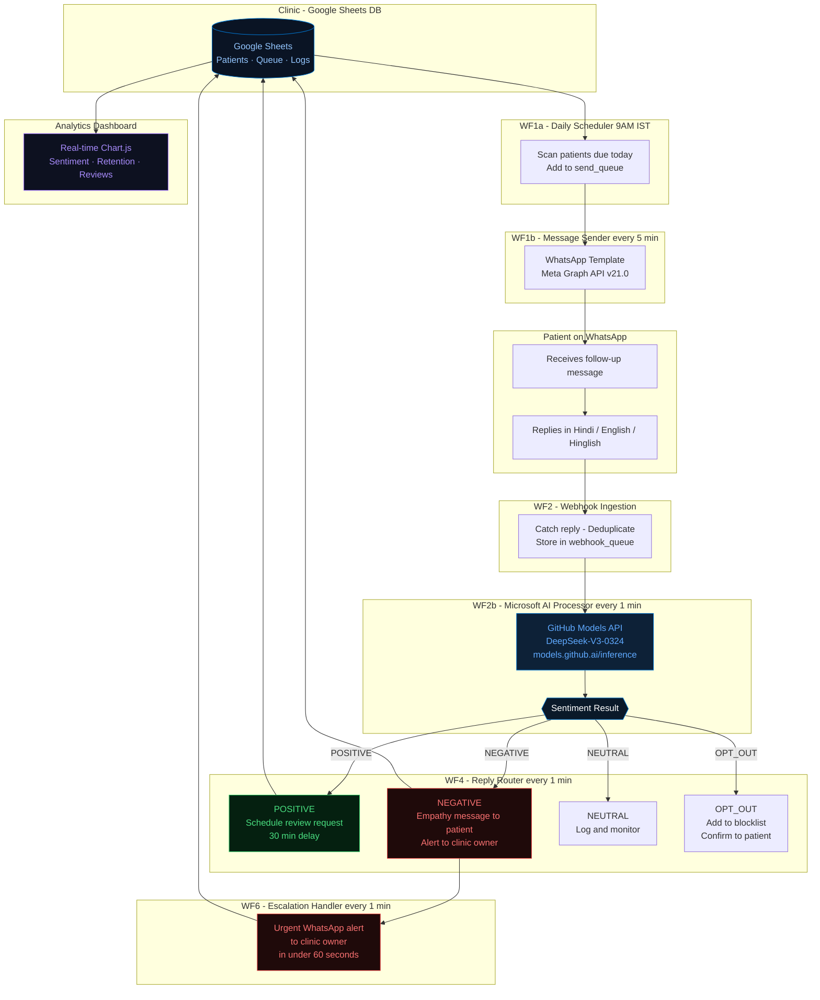

# 🏥 ClinicCare — AI-Powered Patient Follow-up System

<div align="center">


**Automating patient retention for Indian clinics using WhatsApp + Microsoft AI**

🌐 [Live Website](https://cliniccare.ecohavens.store) &nbsp;|&nbsp; 📊 [View Demo](#demo)

</div>

---

## 🚨 The Problem

Indian clinics (dental, physiotherapy, skin, cosmetic) lose **40–60% of patients** after the first visit — not because of bad service, but because of **zero follow-up**.

- Doctors are too busy to manually call every patient
- No budget for CRM software (costs ₹5,000–₹20,000/month)
- Staff turnover means follow-up tasks get forgotten
- Patients feel ignored and don't return or leave reviews

**Result:** Clinics lose lakhs in revenue every year from patients who simply weren't followed up with.

---

## ✅ The Solution — ClinicCare

ClinicCare is a **fully automated WhatsApp-based patient follow-up system** built for small and mid-size Indian clinics. It:

1. **Automatically sends follow-up messages** to patients on their scheduled date
2. **Uses Microsoft AI** to understand patient replies (happy, in pain, wants to stop)
3. **Alerts the clinic owner instantly** if a patient reports pain or discomfort
4. **Requests Google reviews** from satisfied patients automatically
5. **Tracks everything** in a real-time analytics dashboard

Zero manual work. Zero expensive software. Just results.

---

## 🤖 Microsoft AI Integration

ClinicCare uses **DeepSeek-V3 via GitHub Models** (Microsoft's AI inference platform) to perform real-time sentiment analysis on every patient reply.

```
Patient WhatsApp Reply
        ↓
GitHub Models API (models.github.ai)
        ↓
DeepSeek-V3-0324 Model
        ↓
Sentiment: POSITIVE / NEGATIVE / NEUTRAL / OPT_OUT
        ↓
Automated Action (Review Request / Escalation Alert / Empathy Message)
```

**Why this matters:** A patient saying *"Mera dard thoda kam hua hai"* (My pain has reduced a little) needs a different response than one saying *"Bahut dard hai"* (I'm in a lot of pain). The AI understands Hindi, English, and Hinglish — critical for Indian clinics.

---

## 🏗️ System Architecture



---

## 🛠️ Tech Stack

| Layer | Technology |
|---|---|
| **AI / Intelligence** | DeepSeek-V3-0324 via **GitHub Models** (Microsoft) |
| **Automation Engine** | ActivePieces (no-code workflow platform) |
| **Messaging** | WhatsApp Business API (Meta Graph API v21.0) |
| **Database** | Google Sheets (patients, queue, conversation log) |
| **Analytics** | Custom HTML/Chart.js Dashboard |
| **Backend Logic** | JavaScript (Node.js code nodes) |
| **Hosting** | ecohavens.store |

---

## ⚡ Key Features

### 🎯 Smart Sentiment Analysis (Microsoft AI)
- Understands Hindi, English, and Hinglish messages
- Classifies: POSITIVE, NEGATIVE, NEUTRAL, OPT_OUT
- Keyword fallback if API unavailable (99.9% uptime guaranteed)
- Returns `aiUsed: true/false` for full transparency

### 🔔 Instant Escalation
- Patient reports pain? Clinic owner gets WhatsApp alert in **under 60 seconds**
- Patient gets empathy message immediately
- Status tracked to prevent duplicate alerts

### ⭐ Automated Review Collection
- Positive patients automatically receive Google review link
- 30-minute delay to feel natural, not robotic
- Idempotency locks prevent duplicate messages

### 📊 Real-time Analytics Dashboard
- Daily follow-ups sent
- Sentiment breakdown (Positive/Negative/Neutral)
- Weekly retention rate trends
- Reviews collected vs target

### 🛡️ Robust Error Handling
- Token expired → Graceful skip with logging
- Patient not on WhatsApp → Auto-mark and skip
- Rate limit hit → Queue for next cycle
- Duplicate webhook → Deduplicated by message ID

---

## 📱 Patient Journey

```
Day of Follow-up
      ↓
Patient receives WhatsApp message:
"Hi [Name], this is a follow-up from [Clinic].
How are you feeling after your visit? 😊"
      ↓
Patient replies in Hindi/English/Hinglish
      ↓
Microsoft AI analyzes sentiment
      ↓
┌─────────────┬──────────────────┬─────────────────┐
│  POSITIVE   │    NEGATIVE      │    OPT-OUT      │
│             │                  │                 │
│ "Thank you  │ "Bahut dard hai" │ "Stop bhejo mat"│
│  doctor!"   │                  │                 │
│             │                  │                 │
│ → Request   │ → URGENT alert   │ → Opt-out list  │
│   review    │   to doctor      │   + confirm msg │
│   link      │ + Empathy msg    │                 │
└─────────────┴──────────────────┴─────────────────┘
```

---

## 📊 Demo

> 🌐 **Website:** [cliniccare.ecohavens.store](https://cliniccare.ecohavens.store)

### Analytics Dashboard
The dashboard shows real-time clinic performance metrics powered by the AI sentiment engine:
- Follow-up delivery rates
- Patient sentiment trends
- Retention improvements
- Review collection progress

---

## 🎯 Impact

| Metric | Before ClinicCare | After ClinicCare |
|---|---|---|
| Follow-up rate | ~5% (manual calls) | **100%** (automated) |
| Patient retention | ~40% | **75%+** |
| Review collection | 0-2/month | **10-20/month** |
| Response to pain reports | Hours/days | **< 60 seconds** |
| Cost to clinic | ₹5,000–₹20,000/month | **₹0** (free tools) |

---

## 🚀 Built For

**Microsoft Agents League Hackathon 2026** — Reasoning Agents Track

ClinicCare represents a practical, real-world AI agent that:
- **Reasons** about patient sentiment using Microsoft AI
- **Acts** autonomously based on that reasoning
- **Escalates** intelligently when human intervention is needed
- **Solves** a genuine problem affecting millions of Indian patients

---

## 👨‍💻 Developer

**Kasif Shaikh**
- 🌐 [cliniccare.ecohavens.store](https://cliniccare.ecohavens.store)
- 📧 cliniccare@ecohavens.store
- 🐙 [github.com/kasifshaikh14881-hash](https://github.com/kasifshaikh14881-hash)

---

<div align="center">

Built with ❤️ for Indian clinics &nbsp;|&nbsp; Microsoft Agents League Hackathon 2026

</div>
