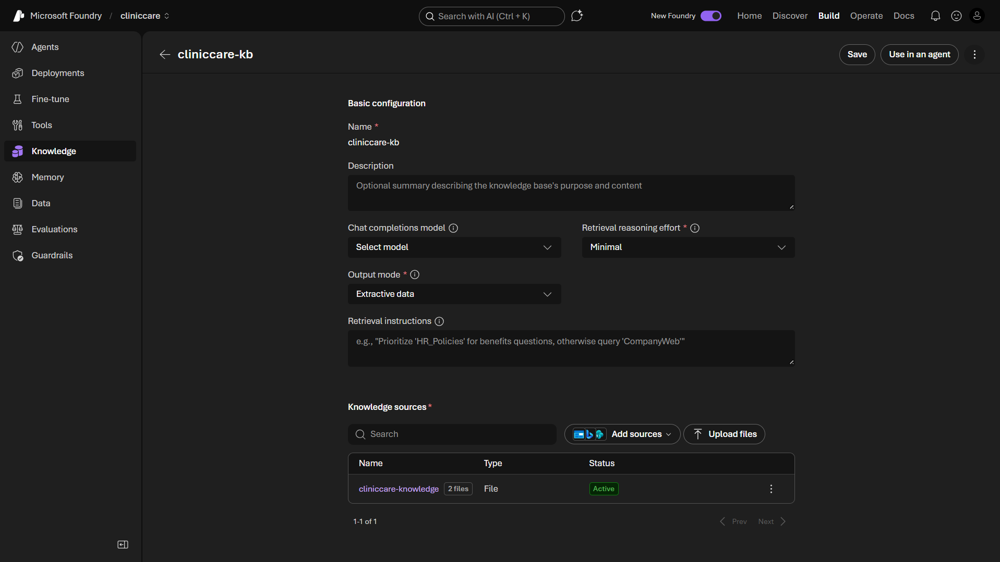
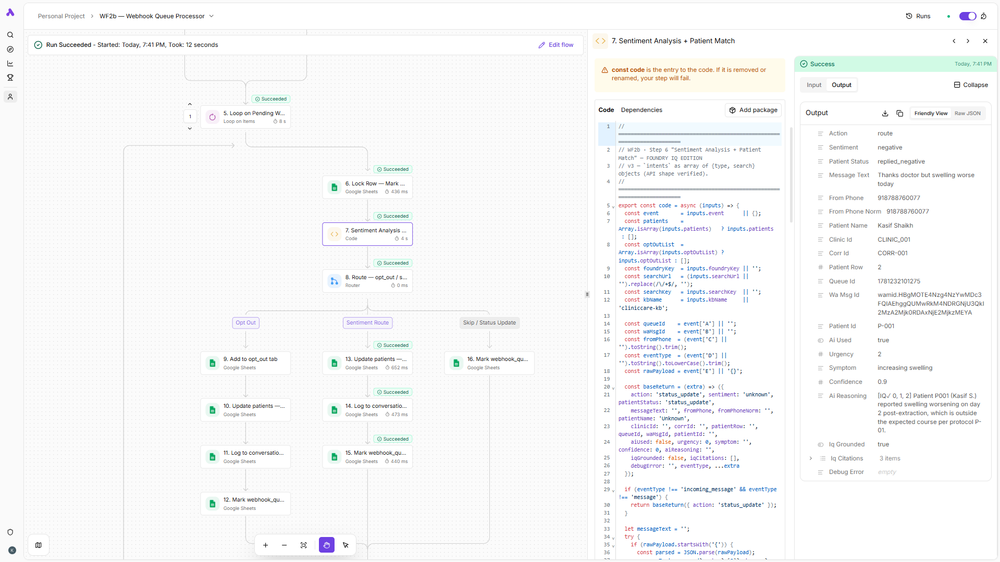
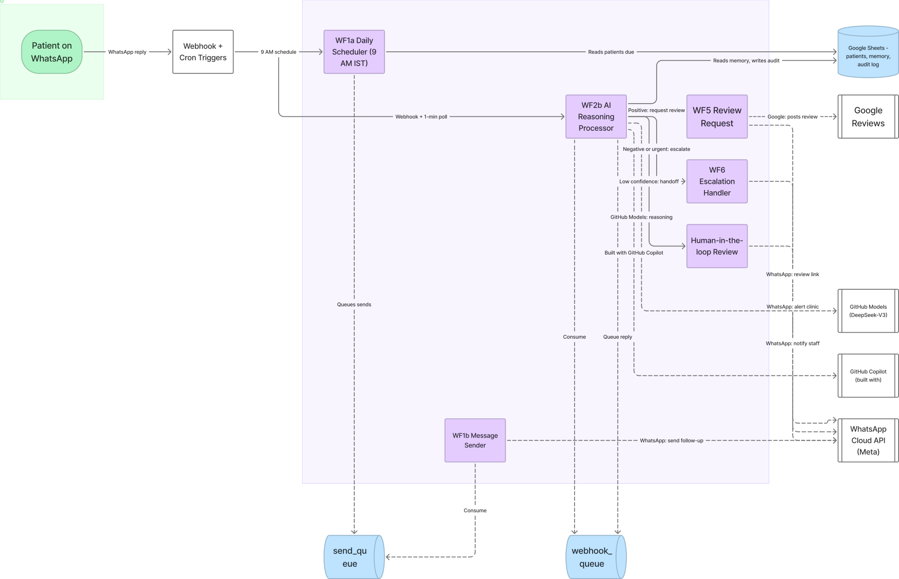
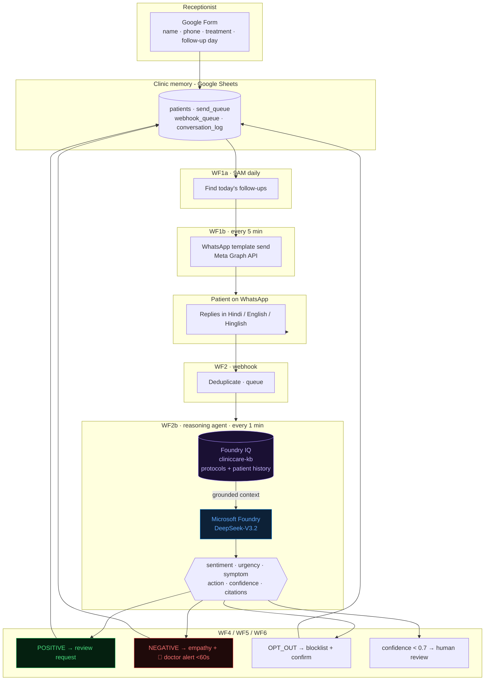

<div align="center">

# 🏥 ClinicCare

### *Because treatment should never be the end of the conversation.*

**An autonomous WhatsApp patient-retention agent for Indian clinics —**
**reasoning on Microsoft Foundry, grounded by Foundry IQ, running in production.**

[](https://youtu.be/DKIyd4jGfOY)
[](https://cliniccare.ecohavens.store)


</div>

---

## 9:53 PM — the message every keyword bot gets wrong

> **9:53 PM IST.** A patient texts the clinic's production WhatsApp number:
> &nbsp;&nbsp;&nbsp;&nbsp;***"Thanks doctor 🙏 but swelling worse today."***
>
> A keyword bot reads **"thanks"** → files the patient as *happy* → sends them a review request.
> A patient with worsening symptoms gets asked for ⭐⭐⭐⭐⭐. That is the exact wrong action.
>
> **9:54 PM IST.** ClinicCare reads the warning *behind* the gratitude.
> Foundry IQ retrieves the patient's record — *tooth extraction, day 2, swelling should be subsiding by now.*
> DeepSeek-V3.2 on Microsoft Foundry reasons over both → **urgency 2 · alert the doctor.**
> The clinic owner's phone buzzes. The patient gets a warm Hinglish reply. Zero medical advice.
>
> **Sixty seconds. I am the developer — and patient #001. This repo is what made that minute possible.**

---

## The problem — silence after treatment

Indian SMB clinics (dental, physio, skin, cosmetic) lose **40–60% of patients after the first visit**. Not because care was bad — because **nobody follows up**:

| Reality at a small clinic | Consequence |
|---|---|
| Doctors see 30–50 patients/day; nobody calls yesterday's | ~5% manual follow-up rate |
| CRMs cost ₹5,000–₹20,000/month | Out of reach, never adopted |
| Warning signs arrive on WhatsApp at 9:53 PM | Unread until morning — or never |
| Happy patients leave silently | Reviews & referrals never collected |

**Treatment is where the conversation ends.** ClinicCare makes it where the relationship begins.

## The solution — one form in, the right action out

The receptionist fills **one Google Form** after each visit (name, WhatsApp number, treatment, follow-up day). Everything after that is autonomous:

1. **Schedule** — daily 9 AM scheduler finds today's follow-ups
2. **Send** — personalised WhatsApp check-in, in the patient's own language (Hindi / English / Hinglish)
3. **Reason** — every reply goes to **DeepSeek-V3.2 on Microsoft Foundry**, grounded by **Foundry IQ** in this patient's treatment record + the clinic's protocols
4. **Act** — happy → Google review invite · worried → **urgent doctor alert in <60s** + empathy reply · "STOP" → instant opt-out
5. **Remember** — every message, reasoning sentence and action lands in the clinic's own Google Sheet. Full audit trail. No black box.

Cost to the clinic: **₹0/month** (free-tier tooling + pay-per-token reasoning).

---

## 🧠 Foundry IQ — grounding that changes the answer

This is the part that makes ClinicCare a *reasoning agent* rather than a classifier.

A symptom is not inherently urgent — **it's urgent relative to where the patient is in their recovery.** Swelling on day 1 after an extraction is normal. The *same* swelling still increasing on day 2+ is a warning (protocol P-01). A keyword can't know that. A model without context can't either.

So before the model reasons, WF2b queries a **Foundry IQ knowledge base** (`cliniccare-kb`, agentic retrieval on Azure AI Search) holding two sources:

- **`clinic_protocols.md`** — per-treatment recovery timelines + triage rules (when is a symptom *outside* the expected course?)
- **`patient_history.md`** — each patient's treatment, date, and expected recovery arc

```text
WhatsApp reply
   │
   ├─① Foundry IQ · POST {search}/knowledgebases/cliniccare-kb/retrieve
   │     intents: [ patient record · protocol for these symptoms at this stage ]
   │     → grounded chunks + citations
   │
   ├─② Microsoft Foundry · DeepSeek-V3.2 chat/completions
   │     system prompt = triage rules + GROUNDED CONTEXT from ①
   │     → strict JSON { sentiment, urgency, symptom, action, confidence, reasoning }
   │
   └─③ Router → review / empathy+alert / opt-out / human review
```

**Real output from the production run (2026-06-11):**

```json
{
  "messageText":  "Thanks doctor but swelling worse today",
  "patientName":  "Kasif Shaikh",
  "iqGrounded":   true,
  "aiReasoning":  "[IQ✓] Patient P001 (Kasif S.) reported swelling worsening on day 2 post-extraction, which is outside the expected course per protocol P-01.",
  "sentiment":    "negative",
  "urgency":      2,
  "symptom":      "increasing swelling",
  "confidence":   0.9,
  "action":       "route → send_empathy_and_alert_doctor"
}
```

The model isn't guessing that day-2 worsening swelling matters — **it cites the patient's record and the protocol it retrieved.** That citation string lands in the audit Sheet on every single decision.

| Foundry IQ knowledge base (live) | Grounded run in Activepieces (live) |
|---|---|
|  |  |

**Graceful degradation:** if retrieval is ever unavailable, the agent is instructed to reason conservatively and escalate on doubt — the flow never breaks, it just gets more cautious.

---

## ⚙️ What actually ran — verified end-to-end

Not a mockup. Real WhatsApp number, real Activepieces runs, real Foundry endpoint, real Sheet.

| Step | Component | Result |
|---|---|---|
| Patient texts at 9:53 PM | WF2 webhook ingestion | `"Thanks doctor but swelling worse today"` queued, deduplicated |
| Retrieval | **Foundry IQ** `cliniccare-kb` | Patient P-001 record + protocol P-01 chunks, with citations |
| Reasoning | **Microsoft Foundry · DeepSeek-V3.2** | `negative · urgency 2 · confidence 0.9` — grounded, cited |
| Escalation | WF6 | 🚨 URGENT alert to clinic owner: name, phone, date, status |
| Patient reply | WF4 | *"Kasif Shaikh ji, aapki baat sunke bahut dukh hua…"* — warm Hinglish, **no medical advice** |
| Audit | Google Sheets | `status=replied_negative · alert_sent=TRUE` + `[IQ✓]` reasoning logged |

End-to-end: **under 60 seconds.**

▶ **Watch it as a film (2:58):** [youtu.be/DKIyd4jGfOY](https://youtu.be/DKIyd4jGfOY) — problem → live system → grounded reasoning → both patient paths → proof.

---

## 🏗️ Architecture




```mermaid
flowchart TD
    subgraph ENTRY[Receptionist]
        FORM[Google Form\nname · phone · treatment · follow-up day]
    end

    subgraph CLINIC[Clinic memory - Google Sheets]
        GS[(patients · send_queue\nwebhook_queue · conversation_log)]
    end

    subgraph SCHEDULER[WF1a · 9AM daily]
        SCH[Find today's follow-ups]
    end

    subgraph SENDER[WF1b · every 5 min]
        SEND[WhatsApp template send\nMeta Graph API]
    end

    subgraph PATIENT[Patient on WhatsApp]
        REPLY[Replies in Hindi / English / Hinglish]
    end

    subgraph INGEST[WF2 · webhook]
        WH[Deduplicate · queue]
    end

    subgraph BRAIN[WF2b · reasoning agent · every 1 min]
        FIQ[(Foundry IQ\ncliniccare-kb\nprotocols + patient history)]
        AI[Microsoft Foundry\nDeepSeek-V3.2]
        OUT{{sentiment · urgency · symptom\naction · confidence · citations}}
        FIQ -->|grounded context| AI --> OUT
    end

    subgraph ROUTER[WF4 / WF5 / WF6]
        POS[POSITIVE → review request]
        NEG[NEGATIVE → empathy + 🚨 doctor alert <60s]
        OPT[OPT_OUT → blocklist + confirm]
        HUM[confidence < 0.7 → human review]
    end

    FORM --> GS --> SCH --> SEND --> PATIENT --> REPLY --> WH --> BRAIN
    OUT --> POS & NEG & OPT & HUM
    POS & NEG & OPT --> GS

    style AI fill:#0d2137,stroke:#0078d4,color:#60aaff
    style FIQ fill:#1a1033,stroke:#a78bfa,color:#c4b5fd
    style NEG fill:#1f0a0a,stroke:#ef4444,color:#f87171
    style POS fill:#052010,stroke:#22c55e,color:#4ade80
```

### Stack

| Layer | Technology |
|---|---|
| **Reasoning** | **Microsoft Foundry** · `DeepSeek-V3.2` (Global Standard, eastus2) · OpenAI-compatible `chat/completions` · strict JSON output |
| **Knowledge grounding** | **Foundry IQ** · knowledge base `cliniccare-kb` on Azure AI Search (Central India) · agentic `retrieve` API · extractive mode, citations |
| **Orchestration** | **Activepieces** · 7 production flows · 1-minute polling · router branches |
| **Channel** | WhatsApp Cloud API (Meta Graph) — the app patients already use |
| **Memory + audit** | Google Sheets — the clinic owns every row; the Sheet *is* the dashboard |
| **Built with** | GitHub Copilot as pair-programmer for the reasoning node, prompts and safety gates |

---

## 🛡️ Safety & reliability — by design, in code

Healthcare adjacency demands restraint. Every one of these is implemented, not aspirational:

| Guardrail | Implementation |
|---|---|
| **No medical advice. Ever.** | System prompt forbids diagnosis/prescription; replies comfort, ask, and route — never advise |
| **Human in the loop** | Every urgency ≥ 2 lands with a real doctor; the agent escalates, a human decides |
| **Confidence gate** | `confidence < 0.7` → no automated action, flagged for human review |
| **One-word opt-out** | "STOP / band karo / रोको" → instant unsubscribe, blocklist, confirmation |
| **Full audit trail** | Message, grounded reasoning + citations, action — all written to the clinic's Sheet |
| **Idempotency** | Row-locking before processing; webhook deduplication by message ID — no double sends |
| **Graceful degradation** | Foundry IQ down → conservative ungrounded reasoning · Foundry down → keyword fallback · the patient never sees an error |
| **Transparent bot** | Every message signed as the clinic's automated assistant — no human impersonation |

### What I deliberately did NOT build

Restraint is a feature. No proprietary medical knowledge base (clinical judgment stays with the doctor). No SaaS dashboard (the Sheet is universal in Indian SMB healthcare). No voice/multimodal (text is what patients reach for). No claims of medical efficacy — **retention is the only metric.**

---

## 📊 Impact

| Metric | Before | After |
|---|---|---|
| Follow-up coverage | ~5% (manual calls, when remembered) | **100%** — every patient, every day |
| Patient retention | ~40–60% drift away | **75%+** projected (6-week post-treatment) |
| Concern escalation | hours–days, often never | **< 60 seconds**, with patient context |
| Software cost | ₹5,000–₹20,000/mo CRM | **₹0/month** |

Small automation. Massive effect: trust → reviews → referrals → the clinic grows.

---

## 📁 Repository

```
cliniccare/
├── README.md
├── ClinicCare_Architecture.svg              # Full system diagram
├── docs/
│   ├── foundry_iq_knowledge_base.png        # Live KB in Microsoft Foundry portal
│   └── grounded_run_output.png              # Live grounded run in Activepieces
├── workflows/                               # Real Activepieces exports (keys scrubbed)
│   ├── WF1a — Daily Patient Scheduler.json  #   9AM IST patient scanner
│   ├── WF1b — Message Sender.json           #   WhatsApp sender (every 5 min)
│   ├── WF2 Webhook Ingestion.json           #   Reply receiver + deduplicator
│   ├── WF2b — Webhook Queue Processor.json  # ★ Foundry IQ retrieve → DeepSeek-V3.2 reasoning
│   ├── WF4 — Reply Router.json              #   Sentiment-based action router
│   ├── WF5 — Review Request Flow.json       #   Google review collector
│   └── WF6 — Escalation Handler.json        #   <60s urgent alert handler
└── dashboard/
    ├── ClinicCare_Dashboard_v2.html         # Analytics dashboard
    └── ClinicCare_Demo_v6.html              # Interactive demo
```

## 🚀 Run it yourself

1. **Foundry** — deploy `DeepSeek-V3.2` in [Microsoft Foundry](https://ai.azure.com); note endpoint + key
2. **Foundry IQ** — Foundry portal → *Knowledge* → create knowledge base `cliniccare-kb` → upload your `clinic_protocols.md` + `patient_history.md` (File source, extractive mode); note the Azure AI Search URL + key
3. **Sheets** — create the master spreadsheet (tabs: `patients`, `send_queue`, `webhook_queue`, `conversation_log`, `opt_out`)
4. **Activepieces** — import the 6 workflow JSONs; in **WF2b** node 6, replace `YOUR_FOUNDRY_API_KEY_HERE` and `YOUR_AZURE_SEARCH_KEY_HERE` (store both as Activepieces **variables**, never plain text)
5. **WhatsApp** — connect a Meta Cloud API number; point its webhook at WF2
6. Text your number *"thanks but it hurts more today"* — and watch the doctor get alerted while the bot stays kind and silent on medicine.

---

## 🏆 Built for Microsoft Agents League 2026

**Track:** Reasoning Agents (Microsoft Foundry) · **Microsoft IQ layer:** Foundry IQ (mandatory integration — see the [grounding section](#-foundry-iq--grounding-that-changes-the-answer))

| Judges look for | Where it lives here |
|---|---|
| Multi-step reasoning | Retrieve → ground → reason → score → gate → route ([workflows/](workflows/)) |
| Reliability & safety | [8 implemented guardrails](#%EF%B8%8F-safety--reliability--by-design-in-code) incl. confidence gate + human-in-loop |
| Real execution | [Production run table](#%EF%B8%8F-what-actually-ran--verified-end-to-end) + [docs/](docs/) screenshots + [demo film](https://youtu.be/DKIyd4jGfOY) |
| Originality | Vernacular-first (Hinglish) healthcare retention, grounded per-patient triage, ₹0 stack |

---

<div align="center">

**Built solo in 8 days by [Kasif Shaikh](https://github.com/CyberKasif)** · Solapur, India

*The 9:53 PM message shouldn't wait for 9 AM.*

</div>
